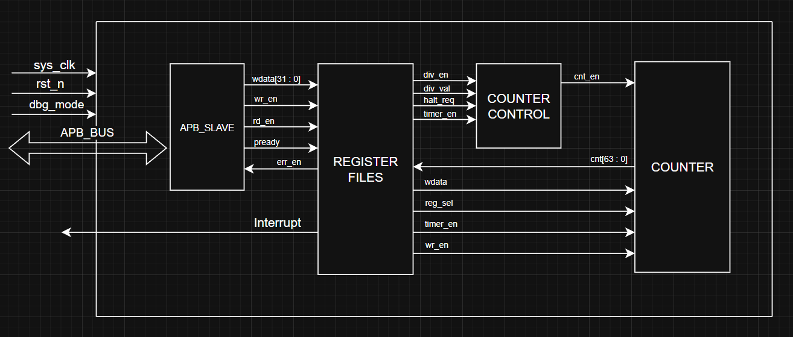
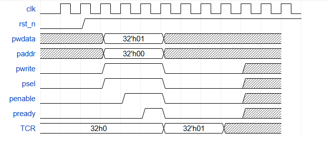

# 🕒 TIMER IP – ADVANCED LEVEL
**Fundamental IC Design and Verification Course**  
**IC Training Center Vietnam (ICTC)**  

---

## 👤 Project Information
- **Student:** Trần Hoàng Phương   

---

## 🧭 1. Overview

### 1.1. Introduction
A **timer** is a hardware or software component that measures time intervals or generates precise timing events.  
In microcontrollers, timers are essential peripherals that count clock pulses to perform tasks such as delay generation, event counting, signal measurement, or waveform generation.

Timers allow systems to perform time-based operations automatically without continuous CPU supervision.  
By configuring timer registers, the microcontroller can perform periodic operations, trigger interrupts, or generate output signals automatically.

**Applications of Timers:**
- Generating accurate time delays (e.g., blinking LEDs, task scheduling).  
- Measuring signal durations or frequencies (e.g., PWM, pulse width).  
- Generating PWM for motor speed or brightness control.  
- Real-time clock and system timekeeping.  
- Event counting or periodic interrupt generation in control systems.  

---

### 1.2. Main Features
- 64-bit **count-up** counter  
- 12-bit address width  
- Register set configurable via **APB bus (APB slave)**  
- Support **byte access**  
- Support **wait state (1 cycle)** and **error handling**  
- Support **halt mode** in **debug mode**  
- **Active-low asynchronous reset**  
- Counter speed can be divided up to **256** via `DIV_VAL`  
- **Timer interrupt** generation (enable/disable configurable)  

---

### 1.3. Block Diagram
You can insert your diagrams here once you export them as images (e.g., from Word or PowerPoint):

```markdown
#### 🧱 Timer IP Block Diagram


#### 🔌 APB Interface Diagram

