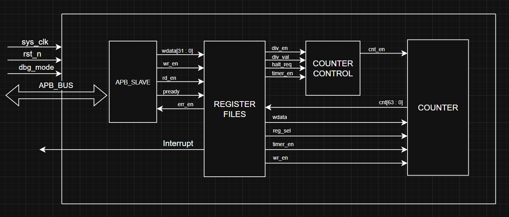
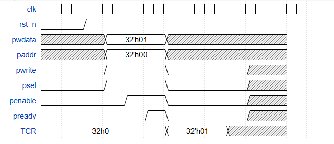

# TIMER IP
**Fundamental IC Design and Verification Course**  
**IC Training Center Vietnam (ICTC)**  

---

## 1. Overview

### 1.1. Introduction
A **timer** is a hardware or software component that measures time intervals or generates precise timing events.  
In microcontrollers, timers are essential peripherals that count clock pulses to perform tasks such as delay generation, event counting, signal measurement, or waveform generation.

Timers allow systems to perform time-based operations automatically without continuous CPU supervision.  
By configuring timer registers, the microcontroller can perform periodic operations, trigger interrupts, or generate output signals automatically.

**Applications of Timers:**
- Generating accurate time delays (e.g., blinking LEDs, task scheduling).  
- Measuring signal durations or frequencies (e.g., PWM, pulse width).  
- Generating PWM for motor speed or brightness control.  
- Real-time clock and system timekeeping.  
- Event counting or periodic interrupt generation in control systems.  

---

### 1.2. Main Features
- 64-bit **count-up** counter  
- 12-bit address width  
- Register set configurable via **APB bus (APB slave)**  
- Support **byte access**  
- Support **wait state (1 cycle)** and **error handling**  
- Support **halt mode** in **debug mode**  
- **Active-low asynchronous reset**  
- Counter speed can be divided up to **256** via `DIV_VAL`  
- **Timer interrupt** generation (enable/disable configurable)  

---

### 1.3. Block Diagram
#### Timer IP Block Diagram

---

### 1.4. APB Slave Timing
#### APB Write Transaction Timing Diagram

The Timer IP communicates with the processor through the **APB (Advanced Peripheral Bus)** interface.  
All register accesses (read/write) follow the APB protocol with **1 wait-state cycle**.

**APB Transaction Phases:**

1. **Setup Phase:**  
   The master drives `psel`, `paddr`, `pwdata`, `pwrite`, and `pstrb`.  
   `penable` remains low during this phase.

2. **Access Phase:**  
   The master asserts `penable` on the next clock cycle.  
   The slave responds by asserting `pready` after **1 wait-state cycle**.

3. **Completion:**  
   When `pready` is high, the transfer is complete.  
   For write transactions, data on `pwdata` is written to the target register.  
   For read transactions, valid data appears on `prdata`.  
   After completion, `psel` and `penable` are de-asserted, returning the bus to idle.

**Key Characteristics:**
- All transfers require **1 wait-state** (pready is asserted 1 cycle after penable).
- `pready` is never asserted in the same cycle as `penable`.
- `pslverr` is driven by the register file error signal (`err_en`) to indicate invalid access (e.g., unaligned address, reserved register).
